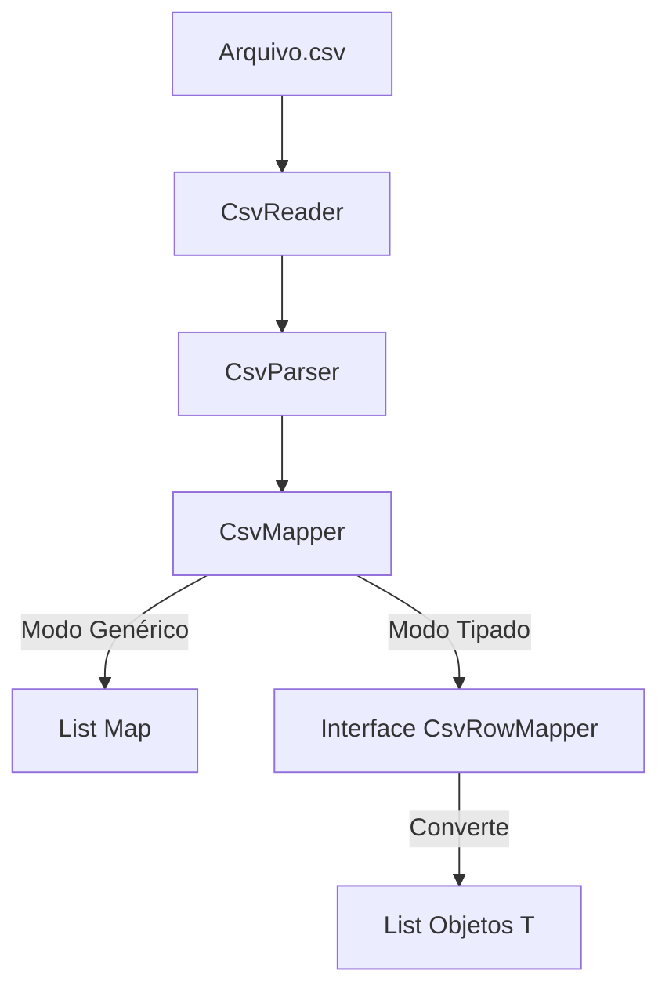

# 🗝️ Chavinho (CsvReader)

**Biblioteca Java de Alta Performance para Leitura de CSV.**

O projeto **Chavinho** é um motor de leitura de arquivos CSV leve, eficiente e agnóstico. Desenvolvido no contexto da **UNIPDS**, ele evoluiu de um leitor simples baseado em Reflection para uma arquitetura robusta focada em Big Data e flexibilidade.

## ✨ Funcionalidades

* **Híbrido:** Suporta tanto leitura genérica (`Map<String, String>`) quanto tipada (`POJOs/Records`) via Strategy Pattern.
* **Alta Performance:** Parser manual **O(n)** (sem Regex). Processa **2 Milhões de linhas em ~1.7 segundos**.
* **Big Data Ready:** Suporte nativo a processamento via **Streams**, permitindo ler arquivos maiores que a memória RAM disponível.
* **API Fluente:** Configuração simples via **Builder Pattern**.
* **Robusto:** Lida corretamente com:
    * Separadores dentro de aspas (ex: `"Suco; de Limão"`).
    * Colunas vazias.
    * Arquivos com ou sem cabeçalho.

---

📦 Como Usar
A biblioteca oferece três formas principais de uso através da classe CsvReader.

1. Leitura Genérica (Map)
Ideal para exploração de dados ou quando não se quer criar classes para o CSV.

```
Java
// Configuração via Builder
CsvReader reader = CsvReader.builder()
        .withHeader(true)
        .withSeparator(';')
        .build();

// Retorna uma Lista de Mapas (Chave = Header, Valor = Célula)
List<Map<String, String>> dados = reader.read("src/resources/dados.csv");

// Acesso aos dados (Headers são sempre minúsculos!)
String nome = dados.get(0).get("nome");
```
---

## 🏗️ Arquitetura

O projeto segue o princípio de Responsabilidade Única (SRP) e Strategy Pattern:



📦 Como Usar
A biblioteca oferece três formas principais de uso através da classe CsvReader.

1. Leitura Genérica (Map)
Ideal para exploração de dados ou quando não se quer criar classes para o CSV.

```
// Configuração via Builder
CsvReader reader = CsvReader.builder()
        .withHeader(true)
        .withSeparator(';')
        .build();

// Retorna uma Lista de Mapas (Chave = Header, Valor = Célula)
List<Map<String, String>> dados = reader.read("src/resources/dados.csv");

// Acesso aos dados (Headers são sempre minúsculos!)
String nome = dados.get(0).get("nome");
```

2. Leitura Tipada (Java Idiomático)
Ideal para regras de negócio onde se deseja Segurança de Tipos (Type Safety).
```
Java
// 1. Defina seu modelo (Record ou Class)
public record Produto(String nome, double preco) {}

// 2. Use o leitor com um Mapper (Strategy)
List<Produto> produtos = reader.read("produtos.csv", row -> {
    return new Produto(
        row.get("nome"),
        Double.parseDouble(row.get("preco"))
    );
});

System.out.println(produtos.get(0).nome());

```
3. Arquivos Gigantes (Stream Processing)
Para processar arquivos massivos sem estourar a memória (OutOfMemoryError).

```
Java
// Processa linha a linha via Callback (Consumer)
reader.process("big-data-2M.csv", linha -> {
    // Esta lógica executa para cada linha individualmente
    System.out.println("Processando: " + linha.get("name"));
});
```

## ⚠️ Normalização de Headers

Para evitar erros de *Case Sensitivity*, a biblioteca converte automaticamente os cabeçalhos:

| No Arquivo CSV | No Código Java (`map.get`) |
| :--- | :--- |
| `Nome` | `get("nome")` |
| `PRECO` | `get("preco")` |
| `E-mail Address` | `get("e-mail address")` |

---

🚀 Benchmark
Teste de carga realizado com arquivo de 311 MB (2 Milhões de linhas):
```
Tempo Médio: ~1.7 segundos

Memória Heap: Limitada a 128MB (-Xmx128m)

Ambiente: Apple Silicon / JDK 25

Método: process() (Stream) com Parser O(n).
```

🛠️ Como Construir e Testar
Pré-requisitos
JDK 25 (Preview/Early Access) ou superior.

Maven.

Compilar
```
Bash
mvn clean install
```
Rodar Testes

```
Bash
mvn test
```

✅ Status do Projeto (TODO)
```
[x] Eliminar classes legadas (Chavinho, Chavinho2) e unificar no CsvReader.
[x] Implementar Builder Pattern para configuração fluente.
[x] Suporte a Big Data (Streams) e tratamento de arquivo de 311 MB com limite de 128MB RAM.
[x] Implementar suporte a Tipagem Forte (Generics + Interface CsvRowMapper).
[x] Melhoria de performance (Substituição de Regex por Parser Manual).

```


Sobre
Este projeto foi desenvolvido na live "Testes Automatizados com Eficácia" da pós Java Elite da [UNIPDS](https://www.unipds.com.br/).

